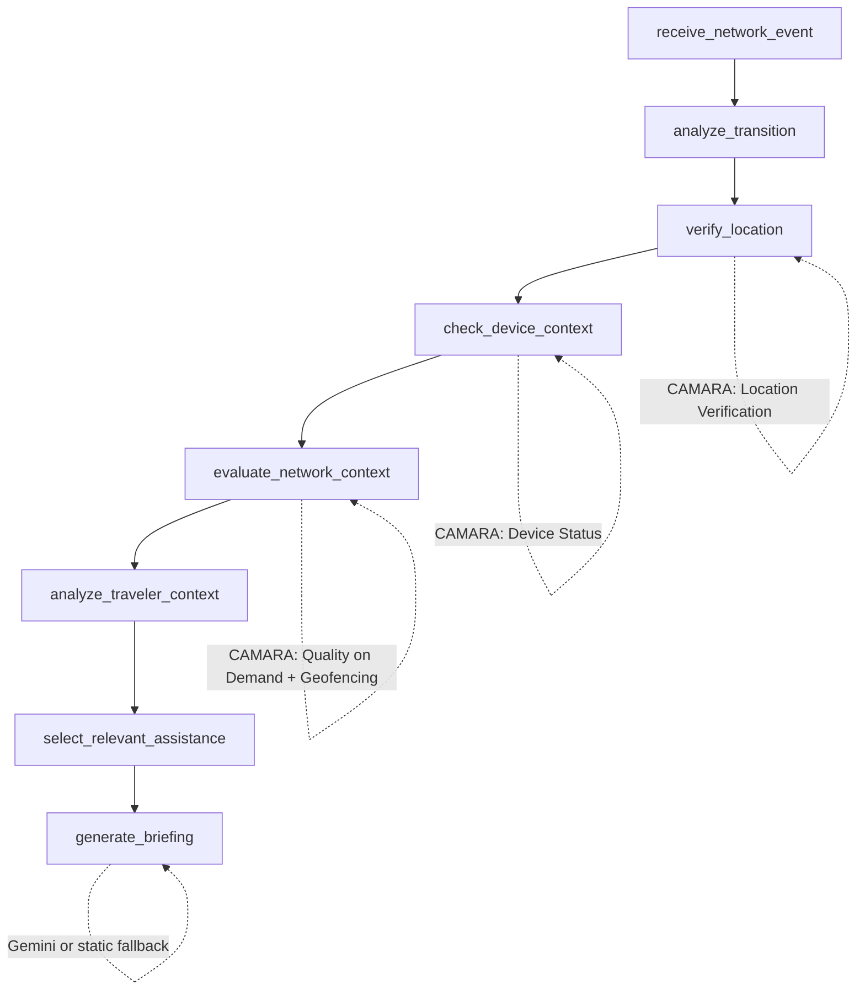
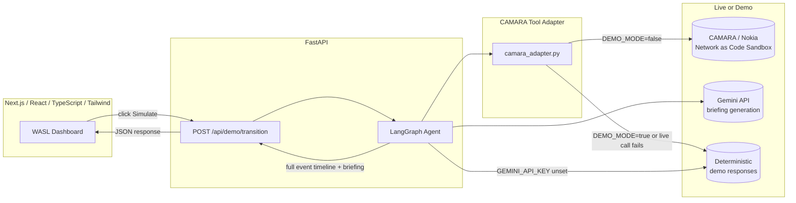

# WASL | وصل

**Your Intelligent Bridge Between Countries**

Built for the GSMA MENA Open Gateway Hackathon 2026.

> CAMARA provides the signal. The agent provides the intelligence. WASL provides the experience.

---

## Overview

WASL is a proactive, agentic travel companion that recognizes when a traveler's
*network context* has changed — not because they asked, but because a telecom
network signal told it so — and responds with a personalized cross-border
briefing before the traveler even thinks to look for one.

The demo scenario: a traveler crosses from **Kuwait 🇰🇼** into **Saudi Arabia 🇸🇦**.
WASL detects the transition, verifies it using CAMARA network APIs, decides
what the traveler actually needs, and generates a briefing — all visible in
one polished web dashboard, no chatbot required.

## Problem

Cross-border travelers currently have to *ask* for everything: roaming
status, emergency numbers, local payment norms, nearby halal food, transport
options. That means either pre-trip research that goes stale, or scrambling
for answers at the border. Telecom networks already know the moment a
traveler's context changes — that signal is just never used proactively.

## Solution

WASL treats a telecom network event (a location/country change, confirmed via
CAMARA APIs) as the trigger for an AI agent that:

1. Verifies the transition really happened (not just guesses from raw signal)
2. Decides which network tools are actually relevant to check
3. Interprets the combined result of those tool calls
4. Selects which categories of travel assistance are relevant to this traveler
5. Generates a short, genuinely useful personalized briefing

WASL is explicitly **not** a chatbot — the traveler never has to ask a
question. The system notices the context changed and acts on it.

## AI Agent Architecture

The agent is a [LangGraph](https://github.com/langchain-ai/langgraph)
`StateGraph` with one node per stage of reasoning:



Each node appends structured events to shared state as it runs, so the final
output is a complete, ordered timeline — this is what powers the **WASL
Intelligence** panel in the UI. Every tool result is also collected into a
separate `tool_activity` list for the **API Activity** panel.

## CAMARA API Usage

| Tool | CAMARA API | Called? | Why |
|---|---|---|---|
| Location Verification | Location Verification | Always | Confirms the traveler is actually in the destination country |
| Device Status | Device Status | Always | Confirms the device is active on-network before proceeding |
| Quality on Demand | Quality on Demand | Always | Establishes baseline connectivity context |
| Geofencing | Geofencing | Not required (this scenario) | Shown deliberately — proves the agent *selects* tools rather than calling everything available |

## Agent Tool Orchestration

The agent doesn't hardcode a fixed set of API calls into the UI — it calls a
Python `camara_adapter` module (`backend/app/tools/camara_adapter.py`) that
exposes one async function per CAMARA capability. The `analyze_transition`
node is where tool selection is decided; today that's rule-based for a
predictable demo, but the seam is designed so an LLM could make that
selection dynamically without changing anything downstream.

## Technical Architecture



## Demo

Single-page dashboard, designed to be fully demonstrable on screen with no
other windows:

1. Open WASL — Kuwait → Saudi Arabia journey card, "Simulate Border
   Transition" button front and center.
2. Click it. The frontend calls the real backend, which runs the full
   LangGraph workflow (not a frontend animation).
3. The **WASL Intelligence** panel plays back the agent's timeline: network
   signal → CAMARA tool calls → verification → decision → briefing
   generation, using the real event data from the backend.
4. Expand **API Activity** to show each CAMARA tool, its status, result, and
   whether the agent selected it.
5. **Agent Decision** card shows the confirmed transition and which
   assistance categories were selected (not all of them are fetched blindly).
6. **Personalized Briefing** reveals seven cards: Connectivity, Emergency,
   Transportation, Payments, Nearby, Explore, Local Context.

## Demo Mode / Fallback

Set `DEMO_MODE=true` (the default) to run entirely on deterministic, clearly
non-live sandbox responses — the app never breaks because of a flaky network
during the actual demo. Set `DEMO_MODE=false` with real `CAMARA_BASE_URL` /
`CAMARA_API_KEY` values to attempt live CAMARA sandbox calls; if a live call
fails for any reason, the adapter transparently falls back to the demo
response for that tool rather than failing the workflow. Every tool result
carries a `source` field (`live_api` or `demo_cache`) so the distinction is
never hidden — see `backend/app/tools/camara_adapter.py`.

Briefing generation works the same way: with a `GEMINI_API_KEY` set, briefings
are generated live by Gemini; without one, a static (but still
scenario-specific) fallback briefing is used.

## Setup Instructions

### Backend

```bash
cd backend
python3 -m venv .venv && source .venv/bin/activate
pip install -r requirements.txt
cp .env.example .env   # edit as needed
uvicorn app.main:app --reload --port 8000
```

### Frontend

```bash
cd frontend
npm install
cp .env.example .env.local   # edit as needed
npm run dev
```

Then open `http://localhost:3000`.

## Environment Variables

**backend/.env**

| Variable | Default | Purpose |
|---|---|---|
| `DEMO_MODE` | `true` | `false` attempts live CAMARA calls |
| `CAMARA_BASE_URL` | _(empty)_ | CAMARA / Nokia Network as Code sandbox base URL |
| `CAMARA_API_KEY` | _(empty)_ | Sandbox API key |
| `GEMINI_API_KEY` | _(empty)_ | Enables live-generated briefings |
| `ALLOWED_ORIGINS` | `http://localhost:3000` | CORS allowlist |

**frontend/.env.local**

| Variable | Default | Purpose |
|---|---|---|
| `NEXT_PUBLIC_API_BASE_URL` | `http://localhost:8000` | Backend base URL |

## Deployment

- **Frontend:** Vercel (set `NEXT_PUBLIC_API_BASE_URL` to the deployed backend URL)
- **Backend:** Render (or any ASGI host) — `uvicorn app.main:app --host 0.0.0.0 --port $PORT`

## Commercial Value

Telecom operators sit on network signals (roaming, location, device status)
that are currently used almost exclusively for billing and fraud detection.
WASL demonstrates a consumer-facing product layer on top of the same CAMARA
APIs — a natural upsell for MNOs bundling "smart roaming" experiences, and a
new proactive-assistance channel for travel, tourism boards, and airlines to
white-label.

## Business Impact

- **For operators:** a differentiated roaming product built on APIs they
  already expose via CAMARA, with no new network infrastructure required.
- **For travelers:** proactive, context-aware assistance without needing to
  know what to ask, when to ask it, or which app to open.
- **For tourism boards / airlines:** a white-labelable "welcome" moment at
  exactly the point a visitor becomes reachable and receptive.

## Team

_Add your team names here._
